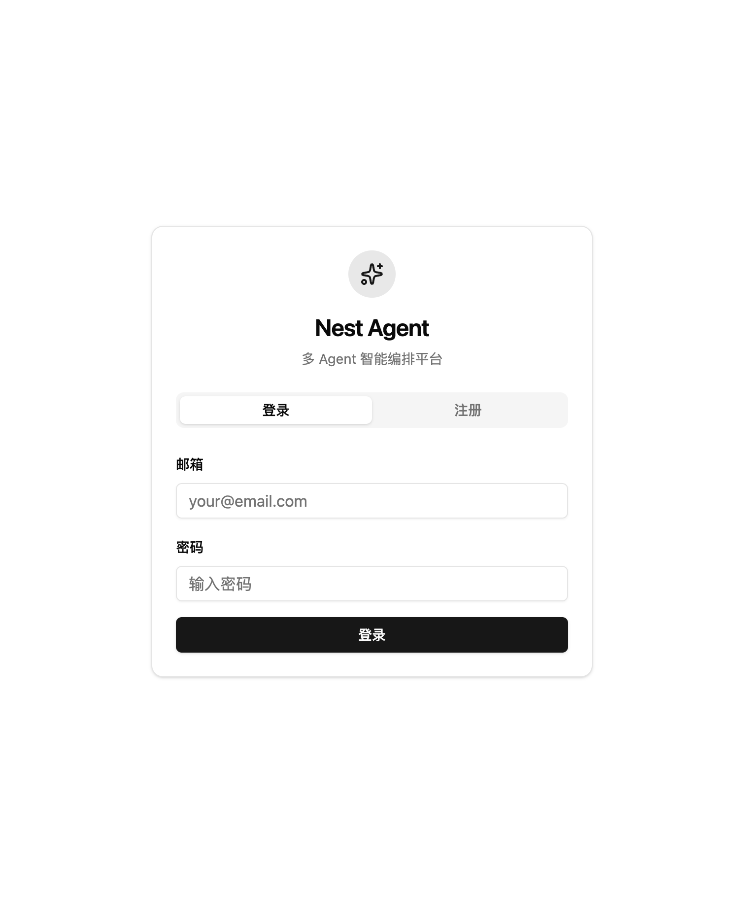
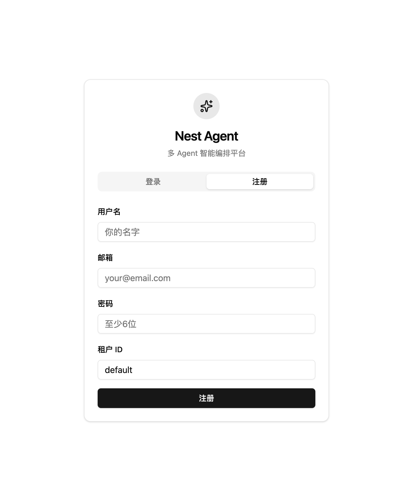
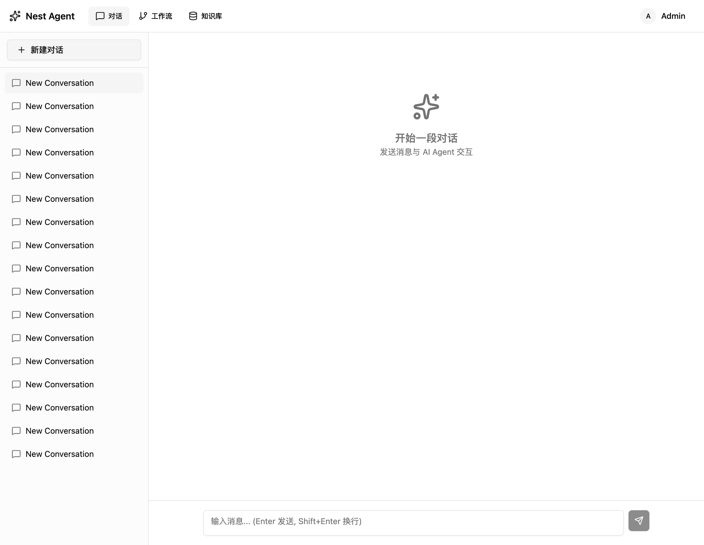
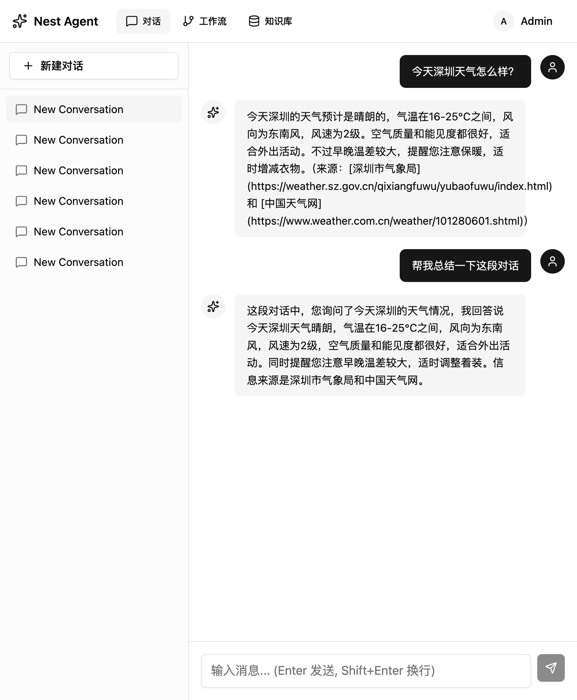
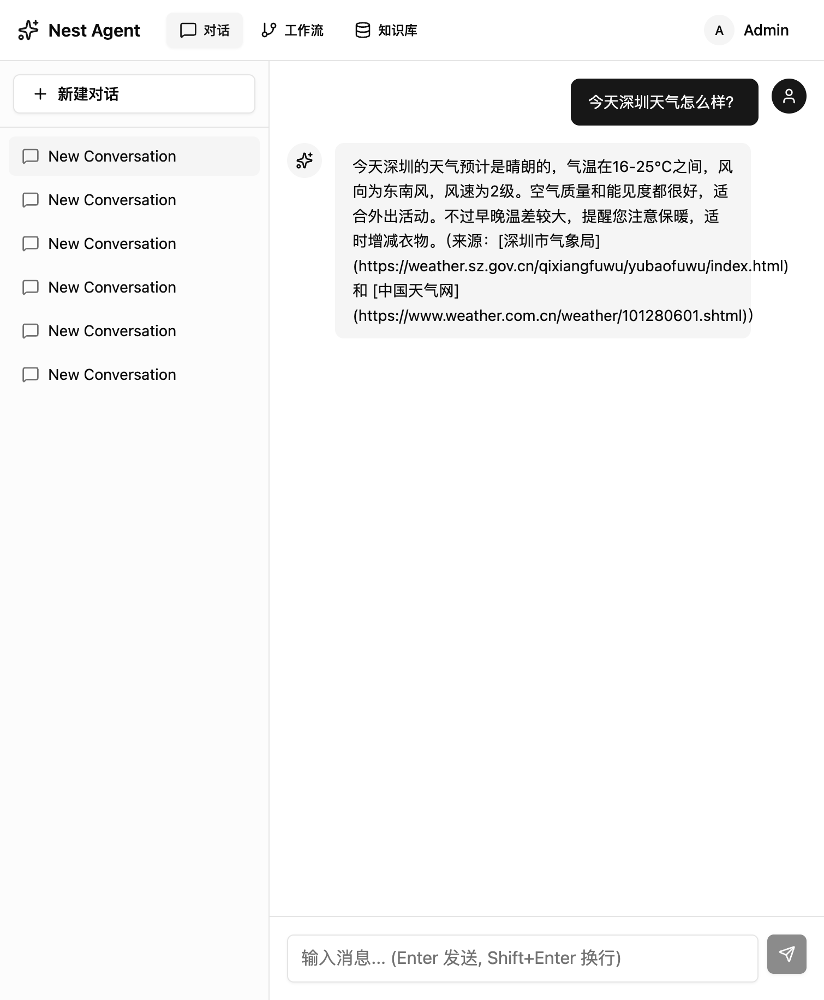
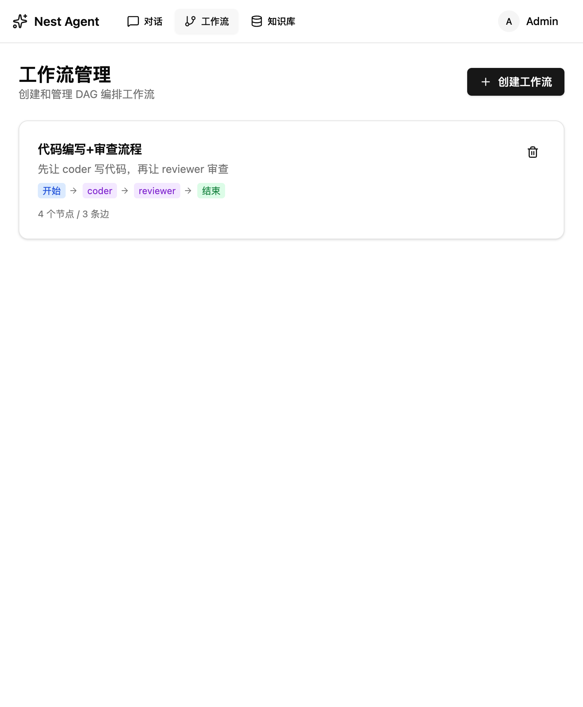
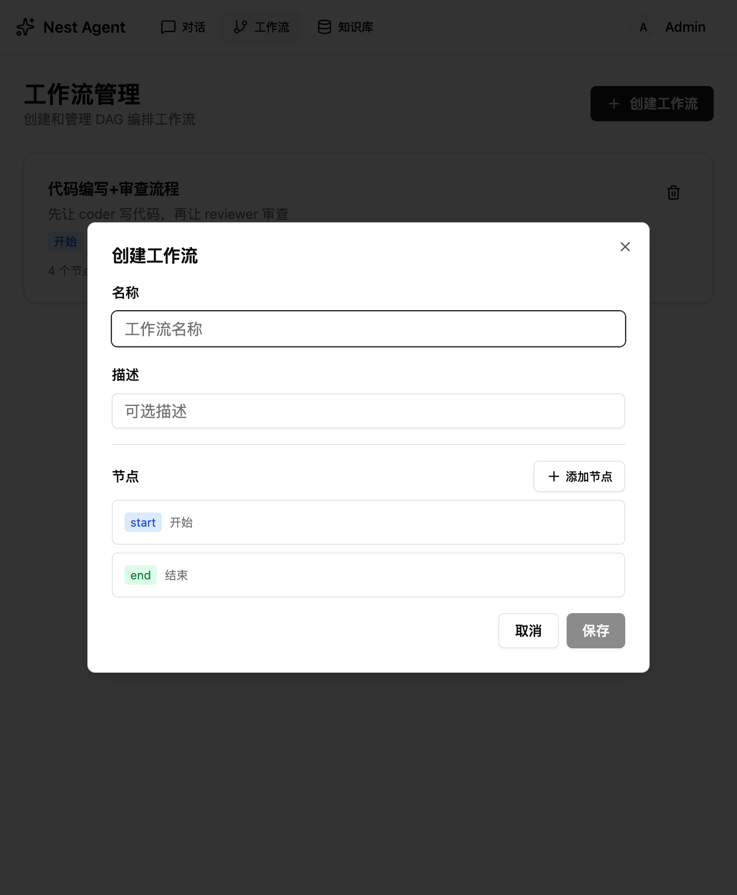
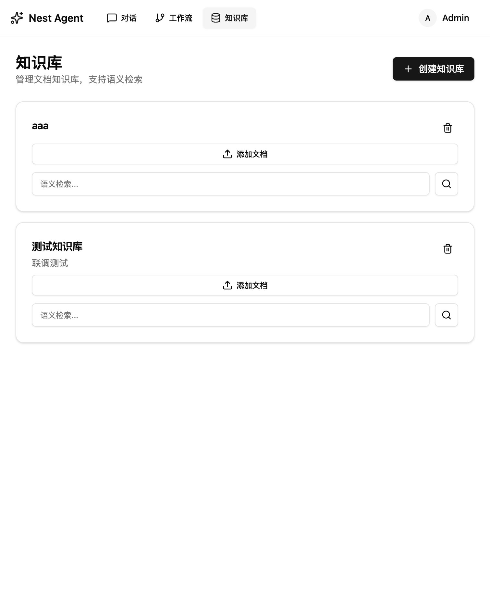
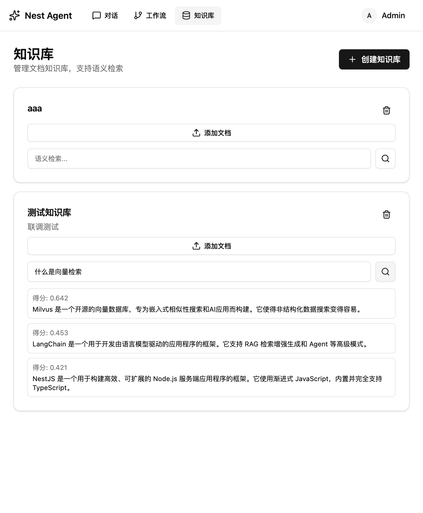

# Nest-Agent

基于 NestJS + LangGraph 的多 Agent 编排平台，支持 Supervisor 自动路由和 DAG 自定义工作流两种模式，遵循 AG-UI（Agent User Interaction Protocol）标准协议。

## 核心能力

### 多 Agent 编排

- **Supervisor 模式** — LLM 充当主管，自动将用户问题路由到合适的 Agent（研究员、直接回答等），Agent 完成后回到主管，直到任务结束
- **DAG 工作流模式** — 用户自定义有向无环图，支持 agent、tool、condition 等节点类型，按图执行

### AG-UI 标准协议

流式对话接口遵循 [AG-UI](https://docs.ag-ui.com) 协议，事件格式标准化：

- 三段式文本消息：`TEXT_MESSAGE_START` → `TEXT_MESSAGE_CONTENT`(增量) → `TEXT_MESSAGE_END`
- 四段式工具调用：`TOOL_CALL_START` → `TOOL_CALL_ARGS` → `TOOL_CALL_END` → `TOOL_CALL_RESULT`
- 运行生命周期：`RUN_STARTED` → `STEP_STARTED/FINISHED` → `RUN_FINISHED`

可直接对接 CopilotKit 等前端 SDK。

### 多 LLM 供应商

| 供应商 | 支持模型 | 说明 |
|--------|---------|------|
| OpenAI | gpt-4o 等 | 支持自定义 baseUrl（兼容 SiliconFlow、Deepseek 等） |
| Anthropic | claude-sonnet-4-20250514 等 | |
| DashScope | qwen-max 等 | 通义千问 |

### RAG 知识库

- 文档分块（RecursiveCharacterTextSplitter）
- BAAI/bge-m3 Embedding 向量化（1024 维，通过 OpenAI 兼容 API）
- Milvus 向量检索（IVF_FLAT + COSINE）
- 按租户隔离的知识库管理
- 支持 JSON 文件批量导入文档

### 工具系统

| 工具 | 说明 |
|------|------|
| web_search | 基于 Tavily API 的实时网页搜索 |
| rag_retrieval | 知识库语义检索 |

Agent 由 LLM 自主决定何时调用工具、调用哪个工具。

### 记忆管理

- **滑动窗口** — 保留最近 N 条消息作为上下文
- **LLM 自动摘要** — 消息超过阈值时，自动调 LLM 对早期对话生成摘要，压缩上下文长度
- **Redis 缓存** — 会话消息缓存，减少数据库查询

### 多租户隔离

JWT 认证 + TenantGuard，所有数据按 tenantId 隔离。

---

## 功能截图

### 认证

| 登录 | 注册 |
|------|------|
|  |  |

### AI 对话

| 对话首页 | 流式输出 | 工具调用结果 |
|----------|----------|-------------|
|  |  |  |

### 工作流管理

| 工作流列表 | 创建工作流 |
|-----------|-----------|
|  |  |

### 知识库

| 知识库列表 | 语义检索 |
|-----------|----------|
|  |  |

---

## 技术栈

| 层次 | 技术 |
|------|------|
| 框架 | NestJS 11 |
| Agent 编排 | LangChain + LangGraph |
| 数据库 | MySQL 8.0 (TypeORM) |
| 缓存 | Redis 7 (ioredis) |
| 向量库 | Milvus 2.3 |
| 认证 | Passport JWT |
| 参数校验 | Zod |
| 前端 | React 18 + shadcn/ui + Vite |
| 包管理 | pnpm workspace (monorepo) |

---

## 快速开始

### 环境要求

- Node.js 18+
- MySQL 8.0
- Redis 7
- Milvus 2.3（可选，RAG 功能需要）

### Docker 一键启动（生产模式）

```bash
# .env 中将 MYSQL_HOST/REDIS_HOST/MILVUS_HOST 改为容器名（mysql/redis/milvus-standalone）
docker-compose up -d
```

会启动 MySQL、Redis、Milvus 及应用本身（前后端一体，端口 3000）。

### 本地开发

```bash
# 1. 启动基础设施
docker-compose up -d mysql redis etcd minio milvus-standalone

# 2. 等待服务就绪
docker-compose ps  # 确认 mysql/redis 为 healthy，milvus 为 running

# 3. 安装依赖
pnpm install

# 4. 配置环境变量
cp .env.example .env
# 编辑 .env，填入：
#   MYSQL_PORT=3307（docker-compose 映射到宿主机的端口）
#   REDIS_PORT=6380（docker-compose 映射到宿主机的端口）
#   OPENAI_API_KEY=你的 API Key
#   OPENAI_BASE_URL=https://api.siliconflow.cn/v1（如用 SiliconFlow）
#   TAVILY_API_KEY=你的 Key（可选，用于 web_search 工具）

# 5. 启动后端（热重载）
pnpm dev            # http://localhost:3000

# 6. 启动前端（另开终端）
pnpm dev:web        # http://localhost:5173，自动代理 /api → localhost:3000
```

### 环境变量

| 变量 | 必填 | 说明 |
|------|------|------|
| `JWT_SECRET` | 生产必填 | JWT 签名密钥 |
| `OPENAI_API_KEY` | 是 | OpenAI API Key |
| `OPENAI_BASE_URL` | 否 | 自定义 OpenAI 兼容 API 地址 |
| `TAVILY_API_KEY` | 否 | 网页搜索功能需要 |
| `MYSQL_HOST` | 否 | 默认 localhost |
| `MYSQL_PASSWORD` | 否 | 默认 nest_agent_pass |
| `REDIS_HOST` | 否 | 默认 localhost |
| `MILVUS_HOST` | 否 | 默认 localhost |
| `CORS_ORIGIN` | 否 | CORS 允许域名，默认 `*` |
| `DEFAULT_LLM_PROVIDER` | 否 | 默认 openai |
| `DEFAULT_LLM_MODEL` | 否 | 默认 gpt-4o |

---

## API 概览

| 模块 | 接口 | 说明 |
|------|------|------|
| 认证 | `POST /api/v1/auth/register` | 注册 |
| | `POST /api/v1/auth/login` | 登录 |
| 对话 | `POST /api/v1/chat/completions` | **AG-UI 流式对话** |
| | `POST/GET/DELETE /api/v1/chat/conversations` | 会话管理 |
| 工作流 | `POST/GET/PUT/DELETE /api/v1/workflows` | 工作流 CRUD |
| 知识库 | `POST/GET/DELETE /api/v1/knowledge-bases` | 知识库管理 |
| | `POST /api/v1/knowledge-bases/:id/documents` | 添加文档 |
| | `POST /api/v1/knowledge-bases/:id/search` | 语义检索 |

完整 API 文档见 [API.md](./API.md)，架构设计见 [架构.md](./架构.md)。

---

## 项目结构

```
nest-agent/
├── src/                # 后端（NestJS）
│   ├── auth/           # JWT 认证 + 多租户守卫
│   ├── chat/           # 对话管理 + SSE 流式接口
│   ├── agent/          # 核心：Supervisor 路由 + DAG 引擎
│   ├── rag/            # RAG 知识库（Milvus 向量检索）
│   ├── llm/            # 多 LLM 供应商抽象
│   ├── tools/          # 工具注册中心（搜索、RAG 检索）
│   ├── redis/          # Redis 缓存
│   ├── entities/       # TypeORM 实体
│   └── common/         # AG-UI 协议、配置、异常过滤器
├── web/                # 前端（React + shadcn/ui + Vite）
│   └── src/
│       ├── pages/      # 页面：对话、工作流、知识库、登录
│       ├── components/ # UI 组件
│       └── lib/        # API 封装、认证上下文
├── Dockerfile          # 多阶段构建（pnpm monorepo）
├── docker-compose.yml  # 基础设施编排
└── pnpm-workspace.yaml # monorepo 配置
```
