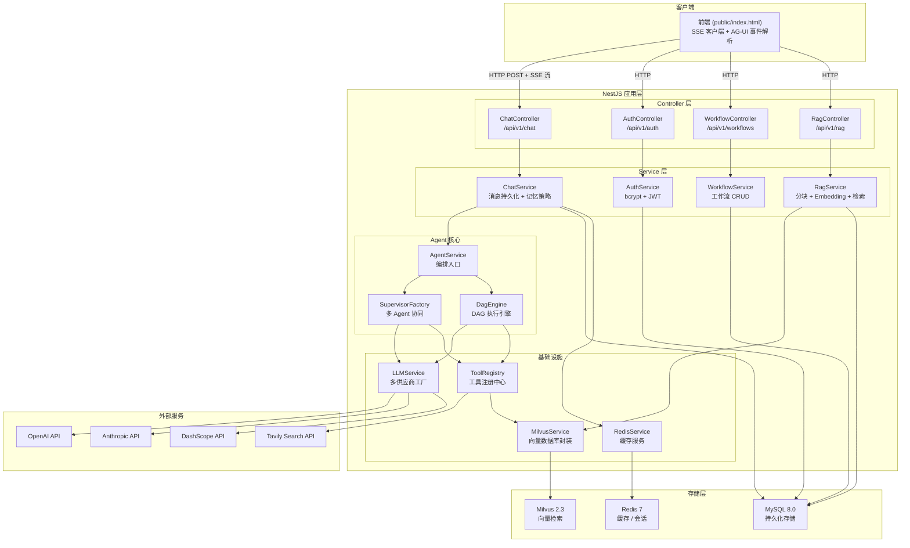
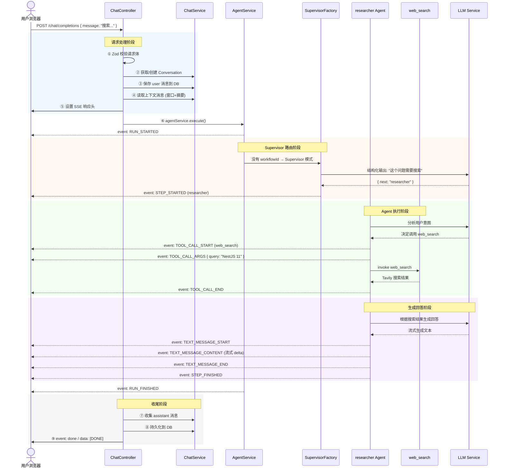
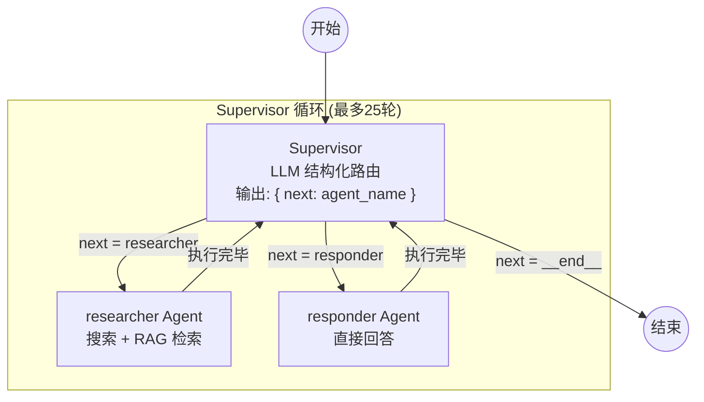
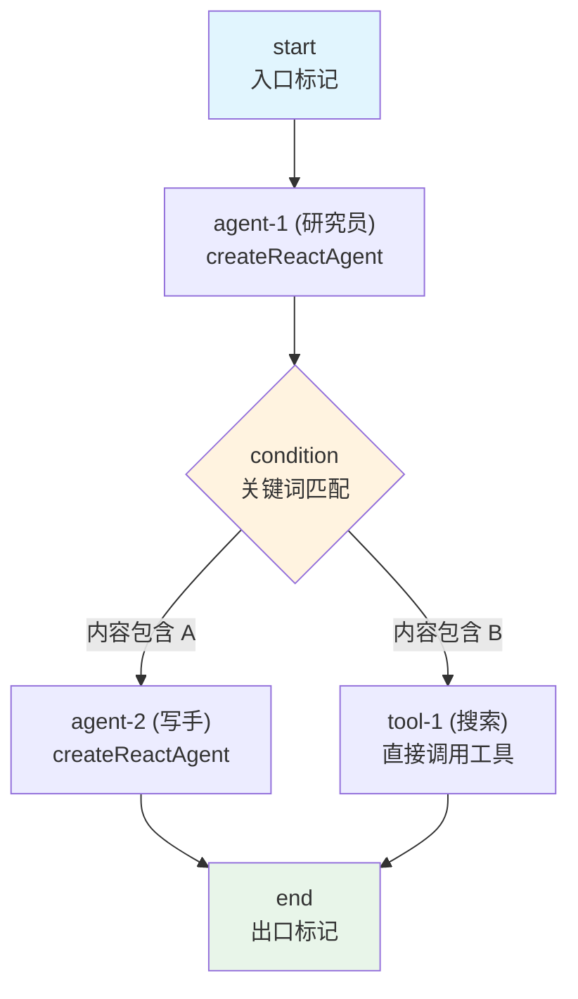
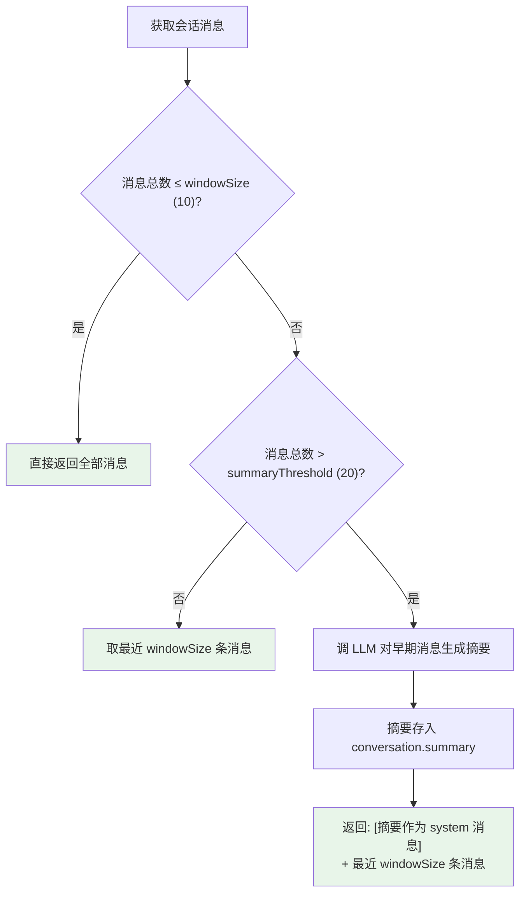
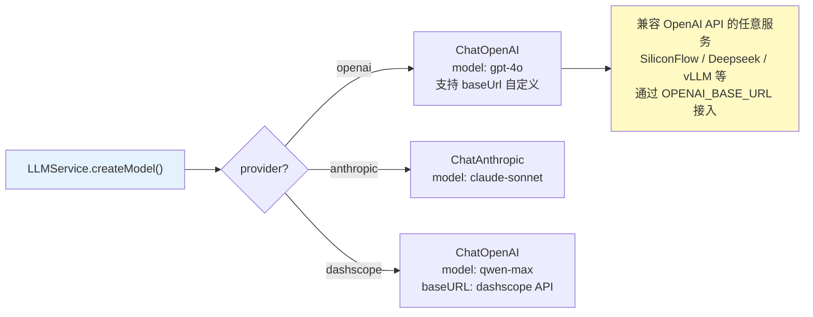
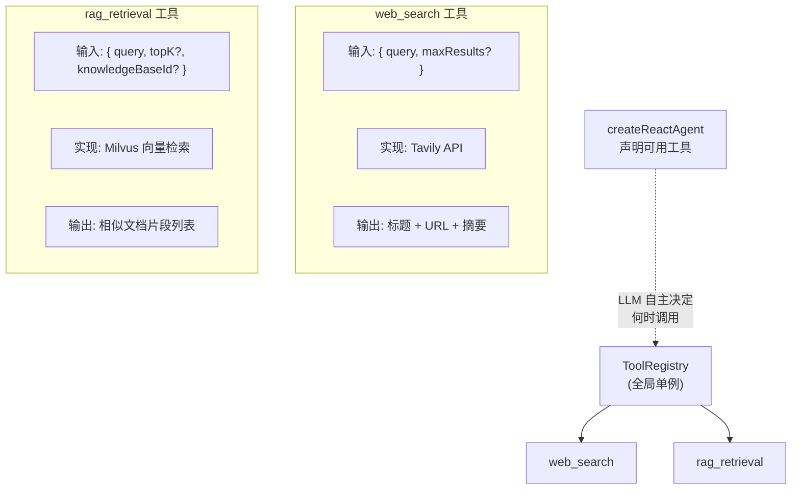
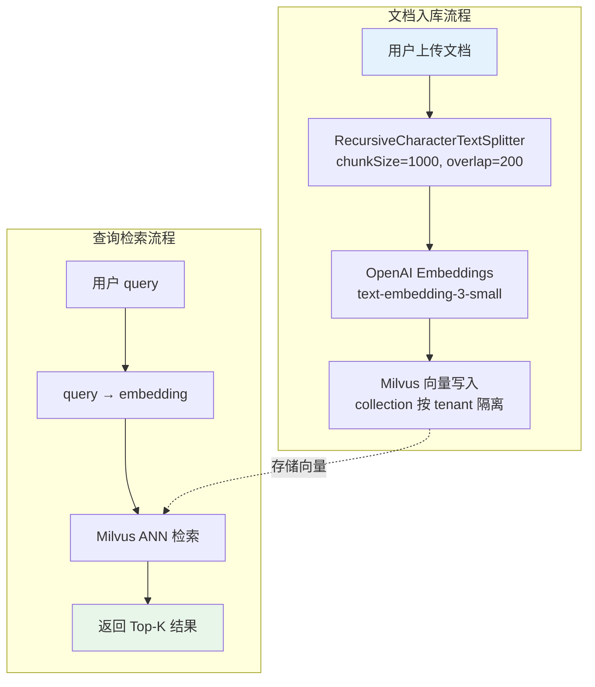
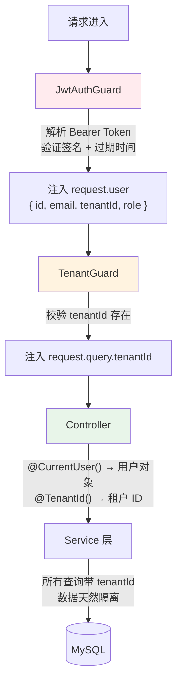
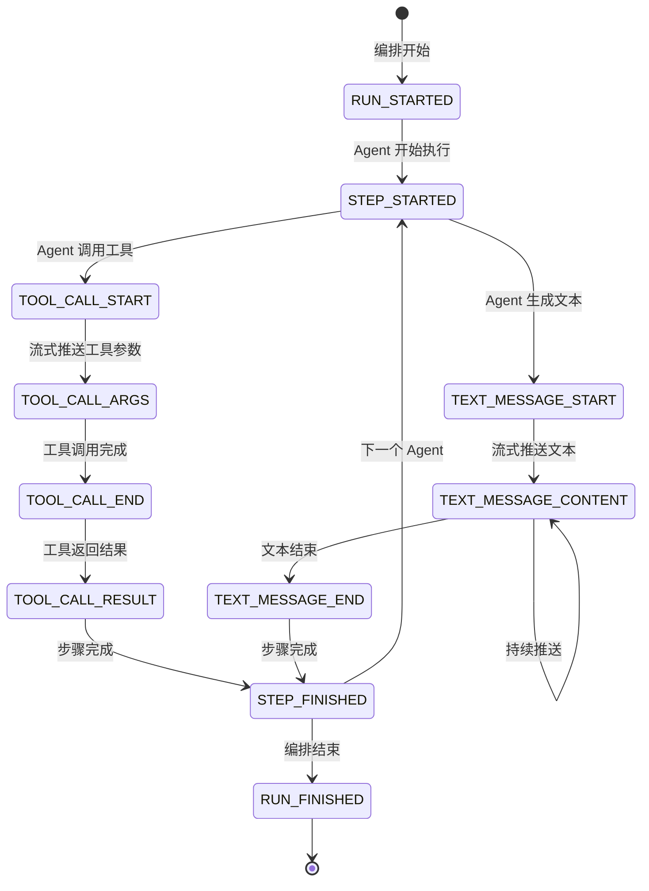

# 架构设计

## 1. 整体架构



---

## 2. 一次对话请求的完整流程

以用户发送「搜索一下 NestJS 11 有什么新功能」为例：



---

## 3. 两种编排模式

### 3.1 Supervisor 模式（默认）

**适用场景：** 不指定 workflowId 时自动使用。LLM 充当「主管」动态路由到不同 Agent。



**工作原理：**

1. Supervisor 是一个带结构化输出的 LLM 节点
2. 输出 schema: `{ next: "researcher" | "responder" | "__end__" }`
3. 路由到目标 Agent 执行，执行完自动回到 Supervisor
4. Supervisor 判断「任务完成」→ 路由到 `__end__`
5. 递归上限 25 次，防止死循环

**代码路径：**
- `supervisor.factory.ts` — 构建 Supervisor 有向图
- `agent.service.ts → executeSupervisor()` — 执行并发射事件

### 3.2 DAG 模式（自定义工作流）

**适用场景：** 指定 workflowId 时使用。用户预定义的有向无环图。



**节点类型：**

| 类型 | 执行方式 | 说明 |
|------|---------|------|
| `start` | 不执行 | 入口标记，DAG 起点 |
| `end` | 不执行 | 出口标记，DAG 终点 |
| `agent` | `createReactAgent(llm, tools, prompt)` | 可调用工具的 AI Agent |
| `tool` | 直接 `tool.invoke()` | 调用指定工具，输出追加到消息链 |
| `condition` | 关键词匹配 | 读取最后一条消息，匹配关键词路由到不同分支 |

**代码路径：**
- `dag-engine.ts` — 编译 nodes/edges 为 LangGraph StateGraph
- `agent.service.ts → executeDag()` — 执行并发射事件

---

## 4. 记忆管理策略

ChatService 实现了**滑动窗口 + LLM 自动摘要**的混合记忆管理：



**缓存策略：**
- 会话消息缓存在 Redis，TTL 3600 秒
- key 格式: `conv:{conversationId}:msgs`
- 新消息追加到缓存末尾（不全量重写）

---

## 5. LLM 多供应商抽象



---

## 6. 工具系统



---

## 7. RAG 知识库流水线



---

## 8. 认证与多租户



---

## 9. AG-UI 事件流协议

系统使用 AG-UI (Agent User Interaction) 协议通过 SSE 推送事件：



---

## 10. 目录结构

```
src/
├── main.ts                          # 启动入口
├── app.module.ts                    # 根模块
│
├── auth/                            # 认证模块
│   ├── auth.controller.ts           # 登录/注册接口
│   ├── auth.service.ts              # bcrypt + JWT
│   ├── auth.module.ts
│   ├── jwt.strategy.ts              # Passport JWT 策略 + 类型定义
│   └── guards.ts                    # JwtAuthGuard + TenantGuard
│
├── chat/                            # 对话模块
│   ├── chat.controller.ts           # SSE 流式接口 + 会话 CRUD
│   ├── chat.service.ts              # 消息持久化 + 记忆策略
│   └── chat.module.ts
│
├── agent/                           # Agent 模块（核心）
│   ├── agent.service.ts             # 编排入口，Supervisor/DAG 二选一
│   ├── agent.module.ts
│   ├── supervisor.factory.ts        # Supervisor 有向图构建
│   ├── dag-engine.ts                # DAG 编译执行引擎
│   ├── workflow.controller.ts       # 工作流 CRUD 接口
│   └── workflow.service.ts          # 工作流持久化
│
├── rag/                             # RAG 模块
│   ├── rag.controller.ts            # 知识库 CRUD + 检索接口
│   ├── rag.service.ts               # 分块 + Embedding + 检索
│   ├── rag.module.ts
│   └── milvus.service.ts            # Milvus 向量数据库封装
│
├── llm/                             # LLM 模块
│   ├── llm.service.ts               # 多供应商工厂
│   └── llm.module.ts
│
├── tools/                           # 工具模块
│   ├── tool-registry.ts             # 工具注册中心
│   ├── web-search.tool.ts           # 网页搜索工具
│   ├── rag-retrieval.tool.ts        # RAG 检索工具
│   └── tools.module.ts
│
├── redis/                           # Redis 模块
│   ├── redis.service.ts
│   ├── redis.module.ts
│   └── redis.constants.ts
│
├── entities/                        # TypeORM 实体
│   ├── user.entity.ts
│   ├── conversation.entity.ts
│   ├── message.entity.ts
│   ├── workflow.entity.ts
│   ├── knowledge-base.entity.ts
│   └── index.ts
│
└── common/                          # 公共模块
    ├── config/configuration.ts      # 配置定义
    ├── filters/global-exception.filter.ts
    ├── interfaces/ag-ui-events.ts   # AG-UI 协议事件定义
    └── decorators/                  # 自定义装饰器
        ├── current-user.decorator.ts
        └── tenant.decorator.ts
```
